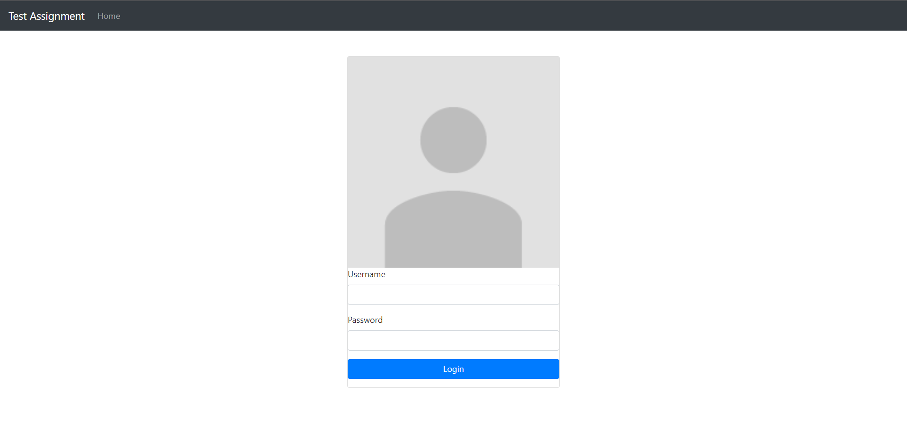
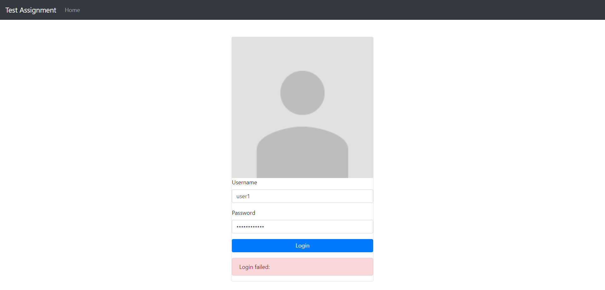
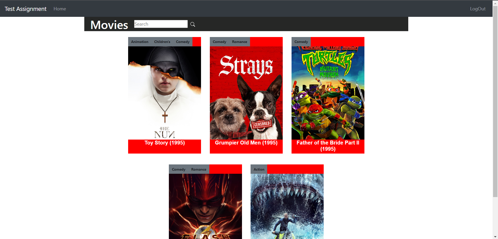
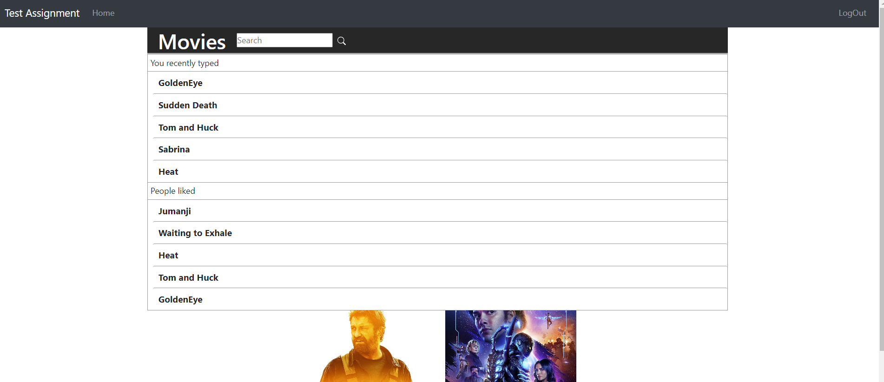
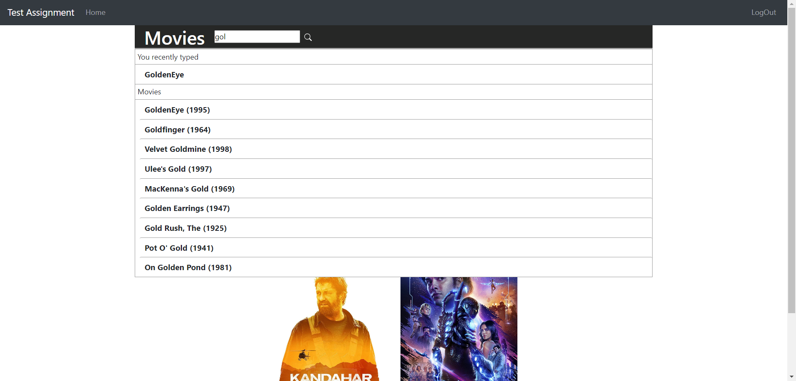
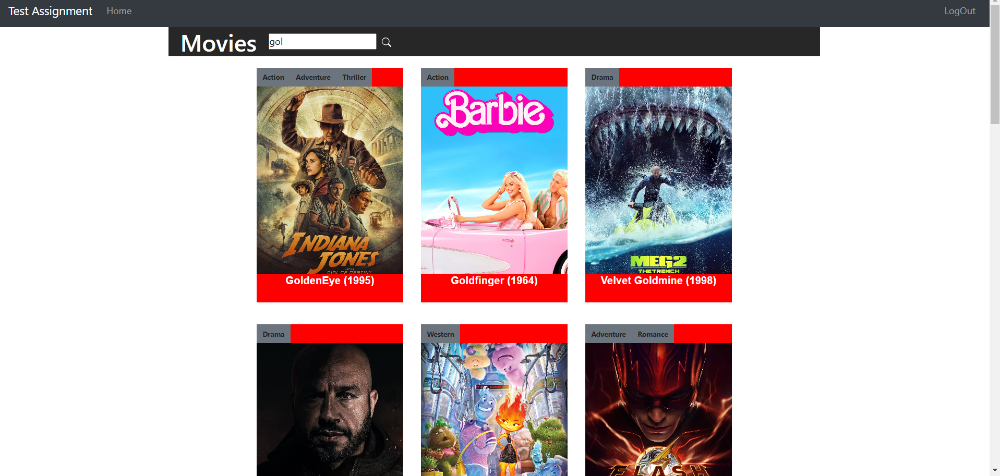
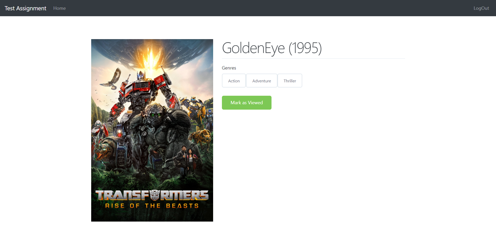

# TestAssignmentFrontEnd
This project was generated with [Angular CLI](https://github.com/angular/angular-cli) version 16.2.3.

## How to Run
- Adjust environment.ts file located in constants folder to link app to server.
- Run npm install when running the server for the first time.
- Run `ng serve` for a dev server. Navigate to `http://localhost:4200/`. The application will automatically reload if you change any of the source files.

# Main functionalities
- Login page where the user insert their username and password.
- To login, please test with these 2 users to see the Learn To Rank concept affecting the recommandations/search results for the users.
  - User 1 : Username = 'user1', Password = 'P@ssw0rd123'.
  - User 2 : Username = 'user2', Password = 'P@ssw0rd123'.
- Here is the Image of login page:

- Once the user click on login a http request is sent to the server where a JWT is sent back to browser and store for future use, eg : when getting recommandatios, search for movie, get search suggestions ...
- If the username or password ire incorrect, a login failed message is then shown to the user.

- If username or password are correct, the user get redirected to home page.
- In the home page, first thing show the list of movies recommended:
  - These are the movies not seen by current user, and most ranked in term of views and clicks for all the users.
  - To do that:
    - First getting the movies seen by current user from MovieView Table.
    - Get the most viewed and clicked movies that are not in the previous list up to 20.
    - Combine the calculate the Total Score for these movies (SCORE OF ONE MOVIE = NUMBER OF VIEWS * 5 + NUMBER OF CLICKS * 1) because the view is worth more than a click in the business logic.
    - Return the best 20 movies in term of score using the elastic search to retrieve the missing informations like year and genre.
  - eg: 
- If the user click on the search input, 2 proposed sections are shown:
  - The recently typed texts by current user: up to 5 suggestions.
  - The best ranked movies using the same scoring method : (SCORE OF ONE MOVIE = NUMBER OF VIEWS * 5 + NUMBER OF CLICKS * 1).
  - We show 10 suggestions in total: number of suggestions of recent typed text + number of best ranked movies.
  eg: 
- When the user start typing the app start providing suggestions based on the text in the input.
  - 2 sections going to show:
    - The recently typed texts by current user and that start with the same keyword: up to 5 elements.
    - The result from Elasticsearch ordered by most viewed/clicked, with words misspelled or stemming (plural/singular handling) implemented.
    - We show 10 suggestions in total: number of suggestions of recent typed text + number of best ranked movies.
  - eg: 
- If the user click on the suggestion or the search icon:
  - The search action is then logged in Database, so that next time when the user start typing, he's going to see the search text that he typed.
  - the movies suggested are updated accordingly.
  - eg: 
- When the user click on an image on the main layout:
  - The user gonna get redirected to the movie details page.
  - A click action going to be logged.
  - eg: 
- When the user click on the mark as viewed button: 
  - The movie can still be searched for but won't be shown in the recommended main section anymore for the current user.
  - A viewed action going to be logged and linked to current user.
  - The user can still search for the movie in the search section and proposed section, it's just won't show in the recommendation section.
